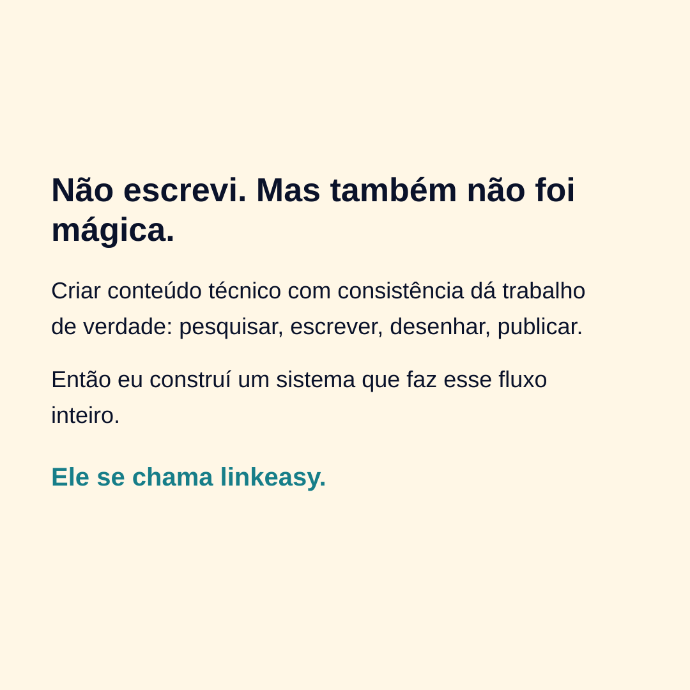
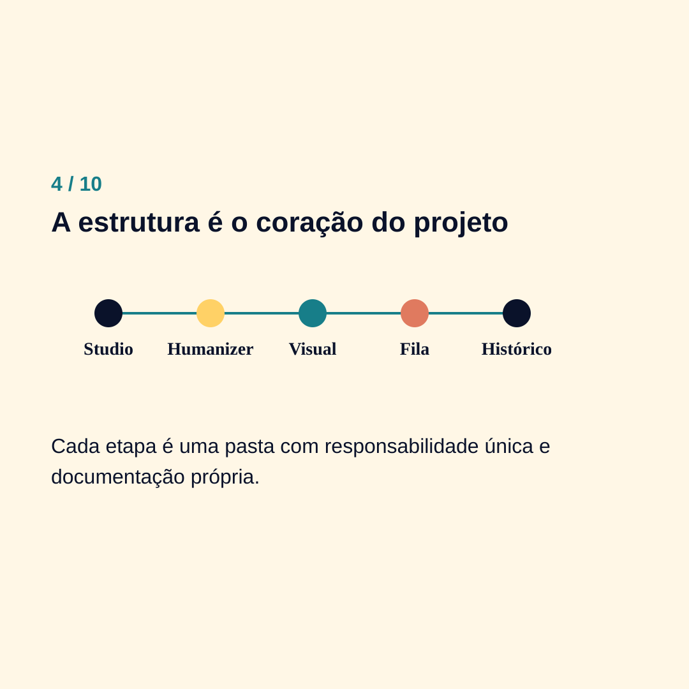
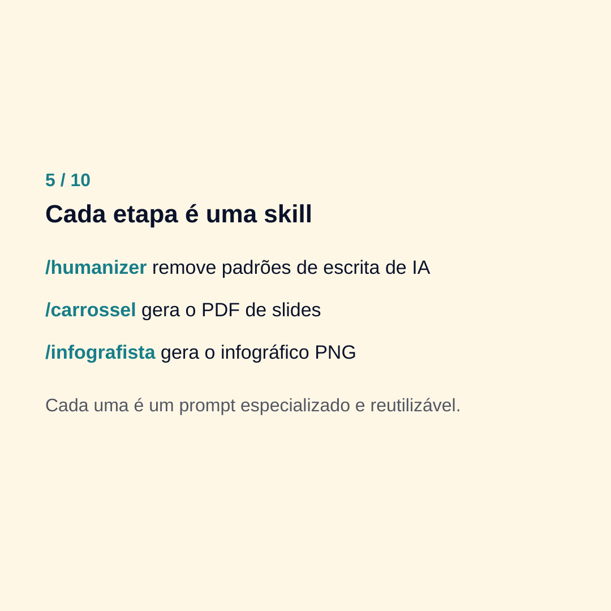
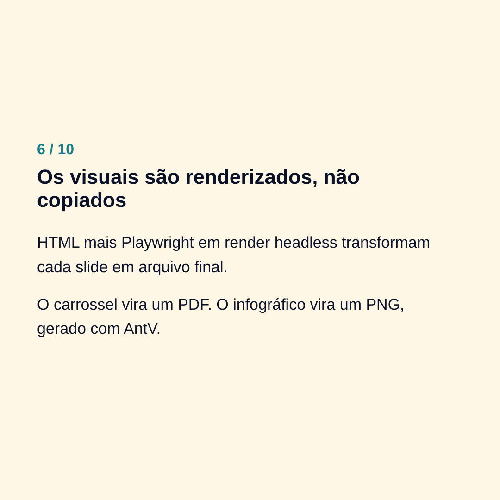
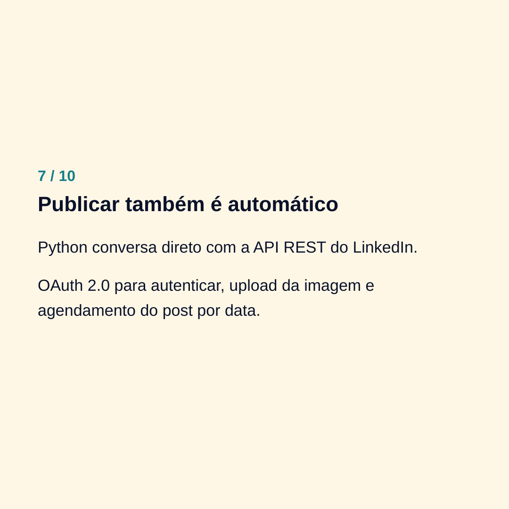
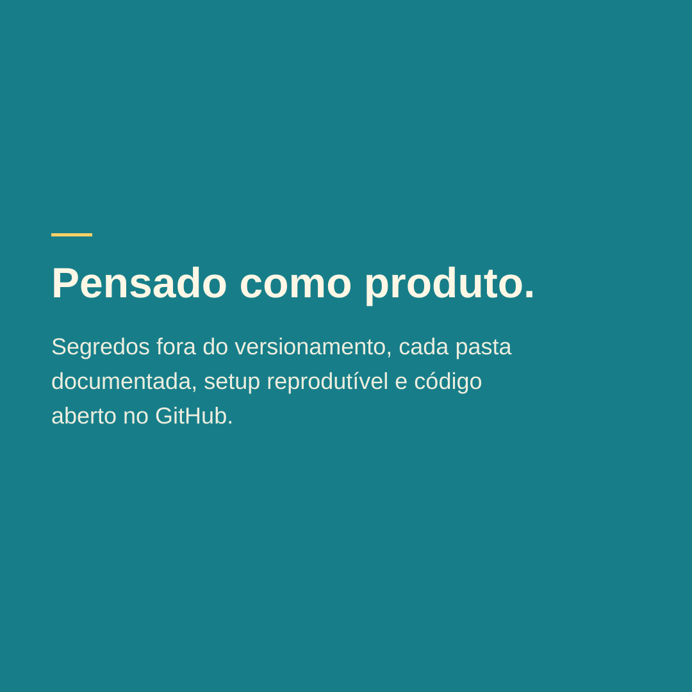
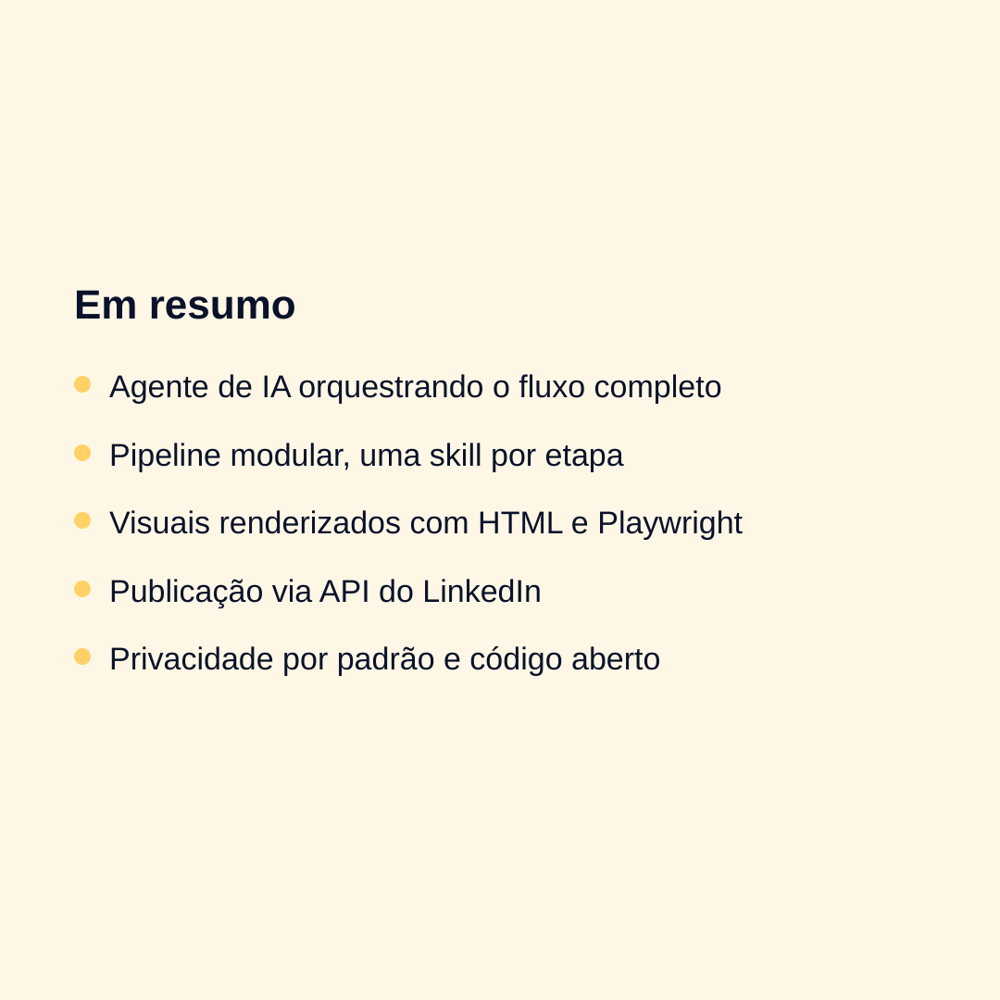

# linkeasy

Pipeline de criação e publicação de conteúdo para o LinkedIn, orquestrado por um agente de IA. O `linkeasy` transforma um tema em um post pronto (texto + visual) e automatiza a publicação via API do LinkedIn, seguindo um fluxo definido de criação, humanização, geração visual e fila de publicação.

O projeto nasceu como uma ferramenta pessoal para construir uma vitrine profissional na área de dados, e demonstra a arquitetura de um agente de conteúdo de ponta a ponta: prompt engineering organizado em skills, geração de assets visuais via render headless e integração com API externa.

## Demonstração

O carrossel abaixo não foi feito à mão. Eu dei um tema só ao linkeasy, "explique o próprio linkeasy para um recrutador", e ele tocou o processo inteiro: escreveu o texto, planejou os slides, aplicou a identidade visual e gerou o PDF. É a saída real da ferramenta, sem nenhum retoque meu.

Pra mim, é a forma mais honesta de mostrar o que o linkeasy faz: deixo ele se explicar. Os slides abaixo estão na ordem em que saíram.


<details>
<summary>Ver o carrossel completo (9 slides)</summary>

<br>










</details>

## Como funciona

```
input (tema ou contexto)
        │
        ▼
   studio/            ← redator gera o texto do post
        │
        ▼
  /humanizer          ← remove padrões de escrita de IA, ajusta a voz
        │
        ├──────────────────────┐
        ▼                      ▼
 /carrossel             /infografista       ← escolha conforme o formato
 (PDF 8–12 slides)      (PNG, 1 imagem)
        │                      │
        └──────────────────────┘
        │
        ▼
   posting/queue/      ← aguarda publicação (com agendamento)
        │
        ▼
     history/          ← registro imutável após publicar
```

**Quando usar cada formato visual:**

- **`/carrossel`** — conteúdo com estrutura de lista, passos ou narrativa em vários pontos. Exporta um PDF de 8 a 12 slides.
- **`/infografista`** — conteúdo com um dado central, comparação ou sequência curta. Gera uma imagem PNG.

## Skills

As skills são as etapas do pipeline implementadas como prompts especializados (em `.claude/skills/`):

| Skill | Função |
|---|---|
| `/humanizer` | Remove sinais de escrita gerada por IA antes de aprovar um post |
| `/carrossel` | Planeja e renderiza um carrossel PDF a partir de um tema ou post |
| `/infografista` | Escolhe um template e renderiza um infográfico PNG a partir de um post aprovado |

A geração de carrossel e do banner usa **HTML + Playwright** (renderização headless para PDF/imagem); o infográfico usa **AntV Infographic** + Playwright.

## Estrutura

| Pasta | Propósito |
|---|---|
| `data/` | Insumos de entrada (currículo, certificados, notas) — usados para alimentar os posts. Conteúdo pessoal fica fora do versionamento. |
| `studio/` | Criação do texto dos posts (`redator.md` define as regras de escrita) |
| `carousel_studio/` | Criação de carrosséis em PDF (templates HTML + renderizador) |
| `infographic/` | Gerador de infográficos PNG (templates de exemplo em `Samples/`) |
| `posting/` | Fila de publicação com agendamento (`queue/` → `published/`) |
| `history/` | Registro imutável dos posts publicados |

Cada pasta tem um `CONTEXT.md` que documenta seu papel no fluxo. O `CLAUDE.md` na raiz define a identidade do agente e as regras globais.

## Publicação (API do LinkedIn)

Dois scripts em Python automatizam a publicação:

- **`auth.py`** — fluxo OAuth 2.0: abre o navegador, captura o código de autorização via servidor local e troca por um access token (`w_member_social`), salvo em `.token.json`.
- **`post.py`** — lê os posts em `posting/queue/`, respeita o agendamento (`scheduled_at`), faz upload da imagem (quando houver) e publica via API REST do LinkedIn, movendo o post para `posting/published/`.

> Posts com texto + imagem única são publicados automaticamente. Carrosséis em PDF ainda são publicados manualmente (limitação da API).

## Setup

Requisitos: Python 3.10+ e Node.js 18+.

```bash
# 1. Dependências Python
python -m venv .venv && source .venv/bin/activate
pip install -r requirements.txt

# 2. Dependências Node (Playwright + AntV)
npm install
npx playwright install chromium

# 3. Credenciais da API do LinkedIn
cp .env.example .env   # preencha com os dados do seu app LinkedIn

# 4. Autenticar e publicar a fila
python auth.py
python post.py
```

## Stack

- **Agente / orquestração:** Claude Code (skills + `CLAUDE.md`)
- **Publicação:** Python (`requests`, `python-dotenv`), API REST do LinkedIn, OAuth 2.0
- **Renderização visual:** Node.js, Playwright, AntV Infographic, HTML/CSS

## Privacidade

Dados pessoais (currículo, certificados, foto, posts publicados) ficam apenas na máquina local e são excluídos do versionamento via `.gitignore`. O repositório contém a engenharia do sistema e exemplos genéricos de template.

## Contato

Sou o Romualdo, trabalho com dados e tecnologia. Se quiser conversar sobre o projeto ou sobre oportunidades:

- LinkedIn: https://www.linkedin.com/in/romualdo-barbosa-b43935244/
- GitHub: https://github.com/romualdobarbosa
